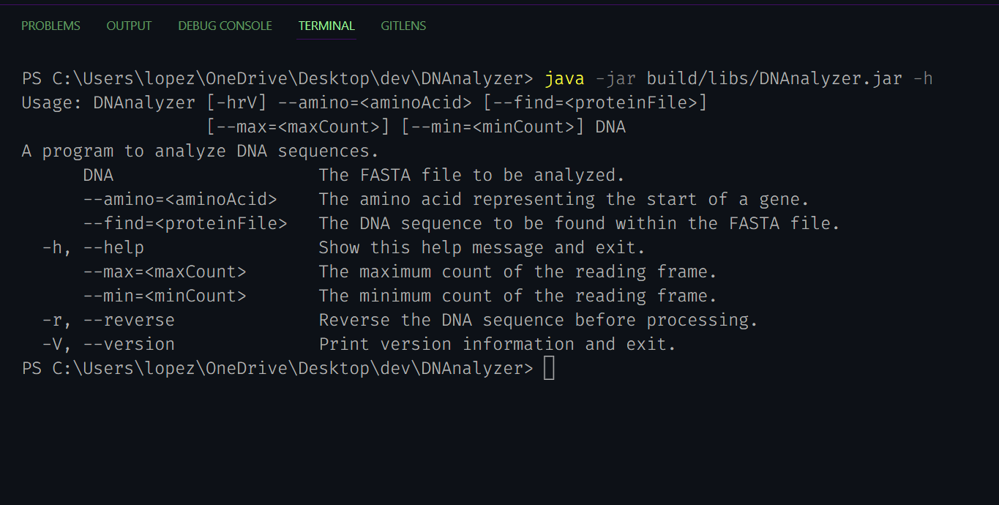

# CLI 参数 - 示例

## 操作系统特定的构建命令

**重要提示**

* MacOS 用户请使用 `./gradlew build`
* Windows 用户请使用 `.\gradlew build`

1. 根据您的操作系统，在终端中输入构建命令。
   

2. 您应该会在终端中收到构建成功的反馈。
   

## 标准CLI理解

CLI（命令行界面）由两部分组成。

1. 可执行文件

```java
java -jar build/libs/DNAnalyzer.jar <参数>
```
（**注意：** 原文档中 `java-jar` 应为 `java -jar`，并且 `<arguments>` 前缺少空格，此处已修正。参数部分也缺少空格，将在下方修正。）

2. 参数

```java
<可执行文件> assets/dna/random/dnalong.fa --amino=ser --min=0 --max=100 -r
```
（**注意：** 原文档中参数间缺少空格，例如 `dnalong.fa--amino` 和 `ser--min` 以及 `100-r`。规范的命令行参数应有空格分隔，如 `dnalong.fa --amino=ser --min=0 --max=100 -r`。翻译中将按规范格式展示，但会备注原文的格式问题。）

## 访问帮助菜单

使用可执行文件来完成命令。

```java
java -jar build/libs/DNAnalyzer.jar <参数>
```
（**注意：** 原文档中 `java-jar` 应为 `java -jar`，并且 `<arguments>` 前缺少空格，此处已修正。）

要访问帮助菜单，请在终端中输入以下命令。

```java
java -jar build/libs/DNAnalyzer.jar -h
```
（**注意：** 原文档中 `java-jar` 应为 `java -jar`，此处已修正。）

您应该会得到以下响应：


## 运行示例命令

使用可执行文件来完成命令。

```java
java -jar build/libs/DNAnalyzer.jar <参数>
```
（**注意：** 原文档中 `java-jar` 应为 `java -jar`，并且 `<arguments>` 前缺少空格，此处已修正。）

在终端中输入以下内容。

```java
java -jar build/libs/DNAnalyzer.jar assets/dna/random/dnalong.fa --amino=ser --min=14 --max=52
```
（**注意：** 原文档中 `java-jar` 应为 `java -jar`，并且 `dnalong.fa--amino` 之间缺少空格，此处已修正为 `dnalong.fa --amino=ser`。）

您应该会得到以下响应：

